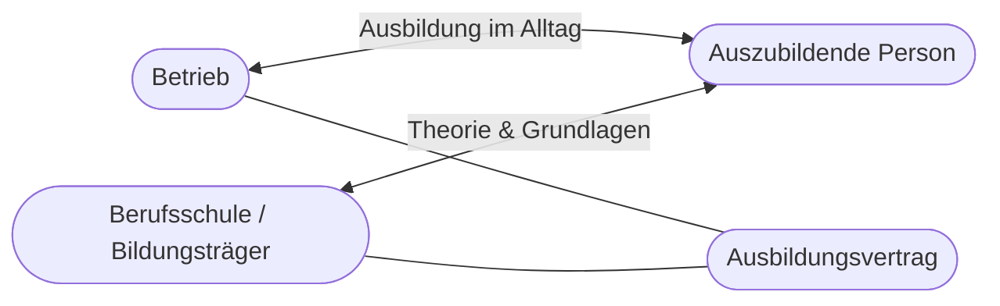
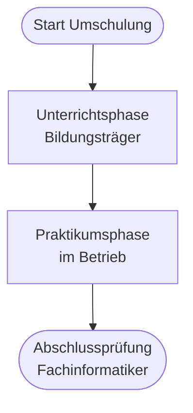

# Kapitel 1 – Berufsbildung und Umschulung

  

  

  

  

  

  

  

  

  

  

<h3>Was du in diesem Kapitel lernst</h3>

- Was das duale System der Berufsausbildung ist und welche Rollen die Beteiligten haben
- Wie die Umschulung zum Fachinformatiker (AE/SI) strukturiert ist und wo du dich darin einordnest
- Welche Unterschiede zwischen regulärer Berufsausbildung (3 Jahre) und Umschulung (2 Jahre) bestehen
- Was einen geeigneten Praktikumsbetrieb ausmacht und welche Anforderungen er erfüllen muss

---

## So gehst du vor

1. Lies die Kapitelinhalte und präge dir die Struktur des dualen Systems ein.
2. Bearbeite die **Kurzübungen** der Reihe nach – von Grundlagen bis Experte.
3. Arbeite die **Workshop-Aufgabe** durch. Sie vertieft das Gelernte an einem zusammenhängenden Szenario.

---

## 1.1 Das duale System der Berufsausbildung

In Deutschland ist die **berufliche Ausbildung** in der Regel **dual** organisiert: Sie findet an **zwei Lernorten** statt – im **Betrieb** und in der **Berufsschule** (oder vergleichbarer Einrichtung). Beide Orte ergänzen sich und sind rechtlich miteinander verknüpft.

**Zentrale Beteiligte im dualen System:**

| Beteiligter | Rolle |
|---|---|
| Auszubildende Person | Lernt berufliche Handlungsfähigkeit, erfüllt Pflichten aus dem Ausbildungsvertrag |
| Ausbildungsbetrieb | Verantwortet die betriebliche Ausbildung, stellt Ausbilder und Arbeitsplatz |
| Berufsschule / Bildungsträger | Unterrichtet berufsbezogene und allgemeine Inhalte |
| Kammer (z. B. IHK) | Prüft Ausbildungsbetriebe, berät, führt Prüfungen durch |
| Bundesministerium / Landesregierung | Schreibt Ausbildungsordnungen und Rahmenlehrpläne |

!!! info "Fachinformatiker AE und SI"
    Der Beruf **Fachinformatiker** ist in zwei Fachrichtungen gegliedert: **Anwendungsentwicklung (AE)** und **Systemintegration (SI)**. Beide Fachrichtungen teilen einen gemeinsamen Teil der Ausbildung; die Spezialisierung unterscheidet sich in Schwerpunktinhalten und Prüfungsaufgaben.

---

## 1.2 Deine Rolle in der Umschulung

Als **Umschüler** zum Fachinformatiker durchläufst du ein beschleunigtes Qualifizierungsprogramm. Du bist keine „klassische" Auszubildende Person im ersten Lehrjahr – dein Werdegang, deine Vorerfahrung und der zeitliche Ablauf unterscheiden sich von einer regulären Ausbildung.

**Typischer Ablauf der Umschulung IT:**

1. **Unterrichtsphase** beim Bildungsträger (oft online): Grundlagen, WISO, Fachinhalte, Prüfungsvorbereitung
2. **Praktikumsphase** im Betrieb: Anwendung des Gelernten, betriebliche Ausbildung, Vorbereitung auf die Abschlussprüfung
3. **Abschlussprüfung** vor der zuständigen Stelle (in der Regel IHK)

**Deine Rolle bedeutet:**

- Du bist **Lernende Person** mit eigenverantwortlichem Lernen – besonders in der Online-Unterrichtsphase
- Du wirst später **Praktikant** bzw. Auszubildende Person im Betrieb mit konkreten Rechten und Pflichten
- Du trägst Verantwortung für deinen **Lernfortschritt**, die **Vorbereitung auf den Praktikumsbetrieb** und die **Abschlussprüfung**

!!! tip "Früher Einstieg, später Praktikum"
    In der Umschulung startest du zunächst überwiegend im Unterricht. Der **Praktikumsbetrieb** kommt oft später – deshalb ist es wichtig, schon in der Unterrichtsphase Ausbildungsinhalte (Vertrag, Plan, Rechte) zu verstehen und aktiv einen passenden Betrieb zu suchen.

---

## 1.3 Reguläre Ausbildung vs. Umschulung

| Merkmal | Reguläre Berufsausbildung | Umschulung Fachinformatiker |
|---|---|---|
| Dauer | In der Regel **3 Jahre** | In der Regel **2 Jahre** |
| Zielgruppe | Meist Jugendliche nach Schule | Erwachsene mit Berufserfahrung oder abgeschlossener Erstausbildung |
| Einstieg | Direkt nach Schule oder früh im Lebenslauf | Nach Qualifizierungsvoraussetzungen (z. B. Arbeitsagentur, Bildungsgutschein) |
| Lernorte | Betrieb und Berufsschule parallel | Zunächst Bildungsträger, später Praktikumsbetrieb |
| Finanzierung | Ausbildungsvergütung vom Betrieb; Unterhalt über Familie/Job | Oft ALG/Übergangsgeld, Bildungsgutschein; im Praktikum Ausbildungsvergütung |
| Tempo | Gleichmäßiger Jahresrhythmus über 3 Jahre | Verdichteter Stoff, höheres Lerntempo |

**Gemeinsamkeiten:**

- Abschlussprüfung nach **Ausbildungsordnung** Fachinformatiker
- **Dualer Charakter**: Theorie und betriebliche Praxis
- **Ausbildungsvertrag** mit Betrieb (im Praktikum)
- Rechte und Pflichten aus dem Berufsbildungsgesetz (BBiG)

!!! warning "Nicht „weniger Ausbildung""
    Die Umschulung ist **zeitlich verkürzt**, nicht inhaltlich „abgespeckt". Du musst vergleichbare Kompetenzen in weniger Zeit aufbauen – das erfordert strukturiertes und selbstgesteuertes Lernen.

---

## 1.4 Der Praktikumsbetrieb

Der **Praktikumsbetrieb** ist dein Ausbildungsbetrieb während der betrieblichen Phase. Er muss bestimmte **Anforderungen** erfüllen, damit die Ausbildung rechtlich und fachlich anerkannt wird.

**Anforderungen an einen Ausbildungsbetrieb (Auswahl):**

| Anforderung | Erklärung |
|---|---|
| Eignung der Ausbildungsstätte | Betrieb muss für die Ausbildung zum Fachinformatiker geeignet sein (Tätigkeiten, Ausstattung) |
| Ausbildungsbefähigung | Betrieb oder Ausbilder muss von der Kammer als geeignet anerkannt sein |
| Ausbildungsvertrag | Rechtlich wirksamer Vertrag zwischen Betrieb und dir |
| Betrieblicher Ausbildungsplan (BAP) | Plan, der Ausbildungsinhalte mit der Ausbildungsordnung abstimmt |
| Ausbildungsvergütung | Mindestvergütung nach BBiG (staffelt nach Ausbildungsjahr) |
| Berufsschul-/Unterrichtszeiten | Keine Ausbildung während Pflichtunterricht ohne Zustimmung |

**Worauf du bei der Betriebswahl achten solltest:**

- **Fachrichtung passend?** AE (Entwicklung) vs. SI (Netze, Systeme, Support) – passt der Betrieb zu deiner Zielrichtung?
- **Ausbildungsstruktur:** Gibt es feste Ausbildungsinhalte, Mentoring, Zeit für Lernen?
- **Technologie-Stack:** Welche Sprachen, Frameworks, Infrastruktur werden genutzt?
- **Ausbilder:** Wer ist ausbildungsbefähigt und wie viel Zeit steht für Anleitung zur Verfügung?
- **Übernahmechancen:** Gibt es Perspektive nach der Prüfung?

!!! info "Suche früh starten"
    Auch wenn der Praktikumsbetrieb später beginnt: **Bewerbungen, Netzwerken und Kammerberatung** solltest du frühzeitig starten. Ein passender Betrieb ist entscheidend für Prüfungserfolg und Karrierestart.

---

## Kurzübungen

{{ task(file="tasks/tag1_01.yaml") }}

{{ task(file="tasks/tag1_02.yaml") }}

{{ task(file="tasks/tag1_03.yaml") }}

---

## Workshop

{{ task(file="tasks/workshop_k1.yaml") }}
