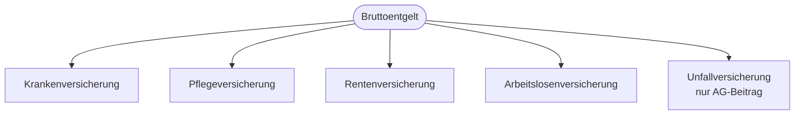

# Kapitel 5 – Sozialversicherung und Sozialrecht

  

  

  

  

  

  

  

  

  

  

<h3>Was du in diesem Kapitel lernst</h3>

- Wie das deutsche Sozialversicherungssystem aufgebaut ist und welche Versicherungen existieren
- Welche Beiträge und Leistungen für Beschäftigte und Auszubildende relevant sind
- Welche Besonderheiten in der Umschulung (Unterricht vs. Praktikum) zu beachten sind

---

## So gehst du vor

1. Lies die Kapitelinhalte und merke dir die fünf Sozialversicherungen.
2. Bearbeite die **Kurzübungen** der Reihe nach – von Grundlagen bis Experte.
3. Arbeite die **Workshop-Aufgabe** durch. Sie vertieft das Gelernte an einem zusammenhängenden Szenario.

---

## 5.1 Das Sozialversicherungssystem

Deutschland hat ein **paritätisches System**: Arbeitnehmer und Arbeitgeber zahlen in der Regel **je die Hälfte** der Sozialversicherungsbeiträge. Die Beiträge werden vom **Bruttoentgelt** berechnet.

---

## 5.2 Die fünf Sozialversicherungen

| Versicherung | Zweck | Beitrag (typisch, vereinfacht) |
|---|---|---|
| Krankenversicherung (KV) | Medizinische Behandlung | ca. 14,6 % + Zusatzbeitrag, geteilt |
| Pflegeversicherung (PV) | Pflegebedürftigkeit | ca. 3,4 % (+ Zuschlag Kinderlose), geteilt |
| Rentenversicherung (RV) | Altersrente, Erwerbsminderung | ca. 18,6 %, geteilt |
| Arbeitslosenversicherung (AV) | Arbeitslosengeld | ca. 2,6 %, geteilt |
| Unfallversicherung (UV) | Arbeitsunfälle, Berufskrankheiten | Nur Arbeitgeber |

!!! info "Auszubildende sind eigenständig pflichtversichert"
    Auszubildende gelten sozialversicherungsrechtlich als **Beschäftigte** und sind daher **ab dem ersten Euro eigenständig pflichtversichert** – unabhängig von der Höhe der Ausbildungsvergütung. Eine beitragsfreie **Familienversicherung** über Eltern oder Ehepartner ist während der Ausbildung deshalb **nicht** möglich. Liegt die Vergütung unter der **Geringverdienergrenze** (§ 20 SGB IV), trägt der Arbeitgeber die Beiträge allein.

---

## 5.3 Auszubildende in der Sozialversicherung

| Thema | Regelung |
|---|---|
| Pflichtversicherung | Auszubildende sind als Beschäftigte in allen fünf Zweigen pflichtversichert |
| Geringverdienergrenze | Liegt die Ausbildungsvergütung unter der Grenze (§ 20 SGB IV), trägt der Arbeitgeber die SV-Beiträge allein |
| Berufsschule | Versicherungsschutz während der Ausbildung, auch in Berufsschulzeiten |
| Unfallversicherung | Gilt auch in Berufsschule und auf dem Weg dorthin |

---

## 5.4 Umschulung: Unterrichtsphase vs. Praktikum

| Phase | Typische Finanzierung / Versicherung |
|---|---|
| Unterricht beim Bildungsträger | Lebensunterhalt oft über ALG I oder Bürgergeld, Lehrgangskosten häufig per Bildungsgutschein – **kein** Beschäftigungsverhältnis beim Träger |
| Krankenversicherung | Bei ALG-I-Bezug **eigenständige Pflichtversicherung** über die Agentur (keine Familienversicherung); sonst individuell klären |
| Praktikum im Betrieb | Ausbildungsvertrag → Sozialversicherung wie bei Auszubildenden |

!!! tip "Status klären"
    In der Unterrichtsphase bist du oft **nicht** Arbeitnehmer des Bildungsträgers. Kläre **Krankenversicherung** und **Leistungsbezug** mit Arbeitsagentur oder Berater – das ist individuell.

---

## 5.5 Weitere Sozialleistungen (Überblick)

| Leistung | Kurzbeschreibung |
|---|---|
| Arbeitslosengeld I | Nach Arbeitslosigkeit bei vorheriger Beschäftigung |
| Bürgergeld | Grundsicherung bei Bedürftigkeit |
| Kindergeld | Für Kinder, unabhängig vom Einkommen (mit Grenzen) |
| Wohngeld | Zuschuss zu Mietkosten bei Bedürftigkeit |

---

## Kurzübungen

{{ task(file="tasks/tag5_01.yaml") }}

{{ task(file="tasks/tag5_02.yaml") }}

{{ task(file="tasks/tag5_03.yaml") }}

---

## Workshop

{{ task(file="tasks/workshop_k5.yaml") }}
